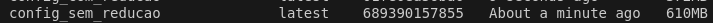
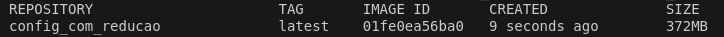

## Reduzindo o Tamanho das Imagens no Python

Exemplo de configuração para uma aplicação web Python utilizando o framework FastAPI e o gerenciador de dependências Poetry:

```dockerfile
FROM python:3.10-slim

ENV PYTHONUNBUFFERED=1
ENV PATH="/root/.local/bin:$PATH"
ENV PYTHONPATH="/"

RUN apt-get update && apt-get install -y curl gcc python3-dev libpq-dev && apt-get clean
RUN curl -sSL https://install.python-poetry.org | python3 - --yes
RUN poetry --version
RUN poetry config virtualenvs.create false

COPY pyproject.toml poetry.lock /

RUN poetry install --no-root
RUN poetry add gunicorn
RUN apt-get remove -y curl && apt-get autoremove -y && apt-get clean
RUN mkdir -p /app/migrations/versions && chmod -R 777 /app/migrations/versions

COPY . .

WORKDIR /app
EXPOSE 8000

CMD ["gunicorn", "-k", "uvicorn.workers.UvicornWorker", "main:app", "--bind", "0.0.0.0:8000"]
```



Esse Dockerfile acima consome mais armazenamento por alguns motivos principais:

1. **Camadas Desnecessárias**  
   Cada `RUN` cria uma nova camada na imagem, aumentando o tamanho total.

2. **Dependências Excedentes**  
   Instalar `gcc`, `python3-dev` e `libpq-dev` é necessário para compilar certas bibliotecas, mas esses pacotes não são mais usados depois da instalação do Poetry e das dependências. Eles ocupam bastante espaço e poderiam ser removidos após a instalação dos pacotes Python.

3. **Instalação do Gunicorn Separada**  
   O `gunicorn` está sendo instalado separadamente com `poetry add gunicorn`. O ideal seria adicioná-lo diretamente no `pyproject.toml` para evitar mais uma camada extra.

4. **Arquivos do Poetry Mantidos**  
   Ao rodar `poetry install --no-root`, o Poetry pode baixar e armazenar pacotes temporários que permanecem na imagem. O cache de pacotes do Poetry não está sendo limpo, o que pode deixar arquivos desnecessários na imagem.

5. **Ordem Ineficiente de COPY**  
   O comando `COPY . .` copia tudo para a imagem, incluindo arquivos que podem não ser necessários. Como `pyproject.toml` e `poetry.lock` são copiados antes, se qualquer outro arquivo da aplicação mudar, o Docker invalidará o cache, forçando uma reinstalação completa dos pacotes Python.

### Abordagens para Reduzir o Tamanho da Imagem

Dockerfile otimizado para reduzir o tamanho da imagem:

```dockerfile
FROM python:3.10-slim

ENV PYTHONUNBUFFERED=1 \
    PATH="/root/.local/bin:$PATH" \
    PYTHONPATH="/"

WORKDIR /app

COPY pyproject.toml poetry.lock ./

RUN apt-get update && \
    apt-get install -y --no-install-recommends \
        curl \
        gcc \
        python3-dev \
        libpq-dev && \
    curl -sSL https://install.python-poetry.org | python3 - --yes && \
    poetry config virtualenvs.create false && \
    poetry install --no-root && \
    poetry add gunicorn && \
    apt-get remove -y curl gcc && \
    apt-get autoremove -y && \
    apt-get clean && \
    rm -rf /var/lib/apt/lists/* && \
    mkdir -p migrations/versions && \
    chmod -R 777 migrations/versions

COPY . .

EXPOSE 8000

CMD ["gunicorn", "-k", "uvicorn.workers.UvicornWorker", "main:app", "--bind", "0.0.0.0:8000"]
```



### Redução de 238MB!

1. **Uso do `--no-install-recommends` no `apt-get install`**  
   - Objetivo: Reduzir o número de pacotes desnecessários instalados.  
   - Como funciona: O parâmetro `--no-install-recommends` instrui o `apt-get` a não instalar pacotes recomendados por outros pacotes, evitando dependências que não são essenciais para o funcionamento da aplicação.

   ```dockerfile
   RUN apt-get update && \
       apt-get install -y --no-install-recommends \
           curl \
           gcc \
           python3-dev \
           libpq-dev
   ```

2. **Combinação de Comandos em uma Única Camada (`RUN`)**  
   - Objetivo: Reduzir o número de camadas criadas na imagem, minimizando o tamanho final.  
   - Como funciona: Comandos `RUN` são combinados para que arquivos temporários sejam removidos antes de criar a próxima camada.

   ```dockerfile
   RUN apt-get update && \
       apt-get install -y --no-install-recommends \
           curl \
           gcc \
           python3-dev \
           libpq-dev && \
       curl -sSL https://install.python-poetry.org | python3 - --yes && \
       poetry config virtualenvs.create false && \
       poetry install --no-root && \
       poetry add gunicorn && \
       apt-get remove -y curl gcc && \
       apt-get autoremove -y && \
       apt-get clean && \
       rm -rf /var/lib/apt/lists/* && \
       mkdir -p migrations/versions && \
       chmod -R 777 migrations/versions
   ```

3. **Remoção de Dependências Temporárias e Limpeza de Cache**  
   - Objetivo: Liberar espaço removendo pacotes e caches não necessários após a instalação.  
   - Como funciona:
     - `apt-get remove -y curl gcc`: Remove pacotes usados apenas para instalação.
     - `apt-get autoremove -y`: Remove dependências que não são mais necessárias.
     - `apt-get clean`: Limpa os caches do `apt-get`.
     - `rm -rf /var/lib/apt/lists/*`: Remove arquivos temporários criados pelo `apt-get`.

4. **Instalação Eficiente do Poetry e Dependências**  
   ```dockerfile
   curl -sSL https://install.python-poetry.org | python3 - --yes && \
   poetry config virtualenvs.create false && \
   poetry install --no-root && \
   poetry add gunicorn
   ```

5. **Criação de Diretório e Permissões**  
   - Objetivo: Criar o diretório de migrações e ajustar permissões sem impactar o tamanho da imagem.
   ```dockerfile
   mkdir -p migrations/versions && \
   chmod -R 777 migrations/versions
   ```

6. **Ordem dos Comandos `COPY`**  
   - Objetivo: Melhorar a eficiência do cache do Docker e reduzir o tempo de construção.
   ```dockerfile
   COPY pyproject.toml poetry.lock ./
   COPY . .
   ```
   Essa ordem evita reinstalar pacotes caso apenas o código-fonte mude, acelerando o build.

Com essas otimizações, conseguimos uma imagem menor e mais eficiente!

