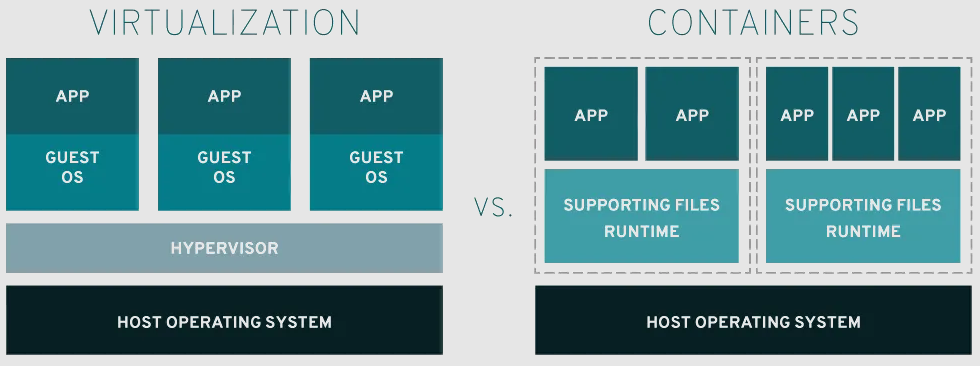

### O que é Docker e sua importância

O Docker **é uma plataforma de software que permite criar, gerir e executar aplicações em containers virtuais**
É uma ferramenta de código aberto que é popular entre desenvolvedores web.

**A importância do Docker está relacionada à sua capacidade de:**

- **Acelerar o desenvolvimento web** O Docker permite criar, implantar e reverter aplicações rapidamente.
- **Garantir consistência** O Docker permite executar aplicações em diferentes ambientes, como Windows, Linux e macOS.
- **Melhorar a eficiência** O Docker permite desativar partes de uma aplicação para reparo ou atualização sem interromper a aplicação inteira.
- **Economizar tempo** O Docker permite automatizar a implantação de aplicações, facilitando o compartilhamento de aplicações ou conjuntos de serviços em vários ambientes.
- **Aumentar a produtividade** O Docker permite que os containers sejam transportados de forma simples entre os diversos ambientes.

O Docker é uma plataforma que pode ser usada para criar aplicativos distribuídos em vários formatos, como laptops, máquinas virtuais e nuvem.

### Diferença entre VMs e Containers

### Visão geral

[Containers](https://www.redhat.com/en/topics/containers-v1-old) e [máquinas virtuais (VMs)](https://www.redhat.com/pt-br/topics/virtualization/what-is-a-virtual-machine) são abordagens para empacotar ambientes de computação. Elas combinam vários componentes de TI e isolam esses ambientes do restante do sistema. A principal diferença entre elas está nos componentes que são isolados, o que afeta a escalabilidade e a portabilidade de cada abordagem.

### O que é um container?

Um container é um software que contém todos os componentes e funcionalidades necessários para executar uma aplicação. As aplicações mais modernas são compostas por vários containers, cada qual responsável por uma função específica. Containers não utilizam um hipervisor. Além disso, costumam ser medidos em megabytes e são considerados uma forma mais ágil e rápida de gerenciar o isolamento de processos.

Um dos fatores que mais contribui para o sucesso dos containers é a portabilidade. Assim como peças de LEGO™ que se encaixam, containers individuais podem ser trocados e movidos entre ambientes diferentes com facilidade. Quando uma aplicação e suas dependências são empacotadas em um container, é possível implantá-la onde for necessário. Ela funcionará exatamente da mesma forma seja no laptop do desenvolvedor, em um data center, na nuvem ou na edge.O

[Docker](https://www.redhat.com/pt-br/topics/containers/what-is-docker), uma plataforma open source para criação, implantação e gerenciamento de aplicações em containers, foi de extrema importância para a evolução dessa tecnologia ao longo dos anos.

### O que é uma máquina virtual?

Máquinas virtuais são essenciais para a cloud computing. Elas replicam o funcionamento dos computadores físicos ao executar sistemas operacionais em instâncias isoladas. É comum hospedar várias VMs em um único servidor, com um hipervisor atuando como uma camada de software lightweight entre elas e o host físico. O hipervisor gerencia com eficiência o acesso aos recursos, permitindo que as máquinas virtuais funcionem como servidores distintos, oferecendo maior flexibilidade e agilidade.

As VMs ganharam popularidade nos anos 2000 devido a iniciativas de consolidação e corte de custos, mas seu uso evoluiu com o tempo. As organizações aperfeiçoaram suas implantações de VM, indo além da consolidação e abrangendo múltiplos casos de uso. Isso inclui oferecer recursos sob demanda para aplicações e otimizar acesso a recursos caros, como GPUs.

As VMs também serviram como base para muitos ambientes de cloud computing, viabilizando a virtualização de recursos e oferecendo suporte a multitenancy e isolamento (vários clientes executando sistemas que compartilham os mesmos recursos).

As máquinas virtuais contêm seus próprios sistemas operacionais, o que permite que elas executem várias funções de uso intensivo de recursos simultaneamente A maior disponibilidade de recursos para as VMs permite extrair, dividir, duplicar e replicar o funcionamento de servidores, sistemas operacionais, desktops, bancos de dados e [redes](https://www.redhat.com/pt-br/topics/virtualization/what-is-nfv) inteiros.

### Como elas funcionam?

### Virtualização

Um software chamado hipervisor separa recursos das máquinas físicas para serem particionados e dedicados às VMs. Quando um usuário emite uma instrução para uma VM que exige recursos adicionais do ambiente físico, o hipervisor retransmite a solicitação ao sistema físico e armazena as alterações em cache. As VMs parecem e agem como servidores físicos e, por isso, podem multiplicar as desvantagens da dependência de aplicações e de um sistema operacional com grande área de ocupação (desnecessária para a execução de uma única app ou microsserviço).

### Containers
Tudo em um container é empacotado e enviado utilizando uma imagem de container, isto é, um arquivo que inclui todas as bibliotecas e dependências. Os arquivos de imagens de container são semelhantes aos pacotes de instalação de software (como RPMs no Linux). No entanto, eles só precisam de um runtime de container e um kernel compatível para executar a aplicação, não importando o sistema operacional usado para criar o container nem a origem das bibliotecas dentro dele. Como os containers são bem pequenos, geralmente temos centenas deles levemente acoplados uns aos outros. Por isso, plataformas de [orquestração de container](https://www.redhat.com/pt-br/topics/containers/what-is-container-orchestration) (como o [Red Hat OpenShift](https://www.redhat.com/pt-br/technologies/cloud-computing/openshift) e o [Kubernetes](https://www.redhat.com/pt-br/topics/containers/what-is-kubernetes)) são usadas para provisioná-los e gerenciá-los.